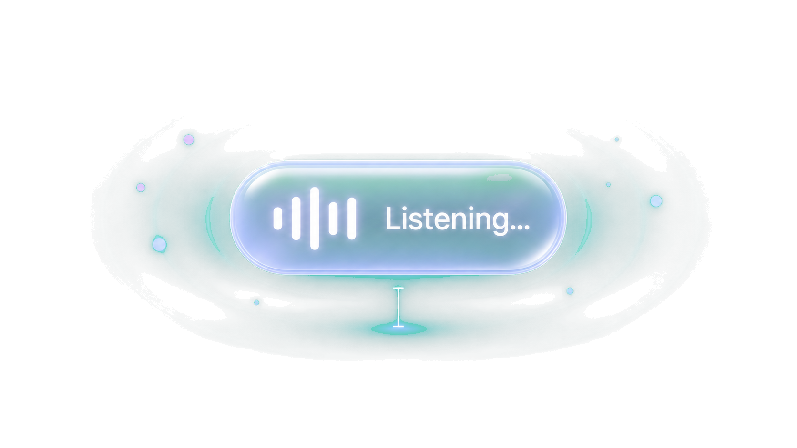

<p align="center">
  
</p>

<h1 align="center">
  
  &nbsp;Mac Whisper
</h1>

<p align="center">
  <strong>Fn</strong> 키를 누른 채 말하세요. 커서가 있는 어디든 음성을 텍스트로 바꿔주는
  macOS 메뉴 막대 앱 — 선택적 LLM 다듬기 포함.
</p>

<p align="center">
  
  
  <a href="./LICENSE"></a>
</p>

<p align="center">
  <a href="https://github.com/bytonylee/mac-whisper/releases/latest/download/MacWhisper.dmg"></a>
</p>

---

<p align="center">
  
</p>

## 소개

Mac Whisper은 메뉴 막대에 상주하는 푸시-투-톡 받아쓰기 앱입니다. **Fn / 🌐 키**를 누른 채 말하고 떼면, 현재 포커스된 입력란에 그대로 입력됩니다. 말하는 동안 Liquid Glass 플로팅 HUD가 실시간 전사와 파형을 보여줍니다. 선택적 LLM 후처리 단계가 주요 음성 인식 오류를 정리한 뒤 텍스트를 주입합니다.

- **Fn/🌐 키 푸시-투-톡** — 키보드 HID에서 직접 읽으므로 단축키 충돌이 없습니다.
- **실시간 플로팅 HUD** — 캡슐 형태, macOS 26에서 Liquid Glass, 그 이하에서는 프로스티드 HUD 재질. 포커스를 빼앗지 않습니다.
- **5개 언어** — 영어, 한국어, 간체 중국어, 번체 중국어, 일본어.
- **온디바이스 인식** 지원 시 (개인정보 보호 + 반응성).
- **선택적 LLM 다듬기** — OpenAI 호환 또는 Anthropic 호환 엔드포인트. 보수적이고 언어 중립적인 후편집.
- **스마트 오디오 라우팅** — 내장 마이크를 강제 사용해 블루투스 헤드셋이 고품질 A2DP를 유지하도록 하고, 받아쓰는 동안 시스템 출력을 음소거합니다.
- **침묵 자동 종료** — 일정 시간 침묵이 지속되면 세션을 종료해 Fn을 오래 누르지 않아도 됩니다.

## 요구 사항

- macOS 26(Tahoe) 이상. `NSGlassEffectView`(Liquid Glass)는 배포 타깃이 26 이상일 때만 실제 프로스티드 재질을 렌더링합니다. 그 이하에서는 평평한 반투명 외관으로 폴백됩니다.
- Xcode Command Line Tools(`swift` / `swiftc`).
- 권한: **마이크**, **음성 인식**, **입력 모니터링**(Fn 키 읽기), **접근성**(텍스트 주입).

## 설치

### 소스에서 (현재 권장)

```bash
git clone <your-repo-url> mac-whisper
cd mac-whisper
make app        # MacWhisper.app 빌드 및 코드사인
open MacWhisper.app
```

리빌드 간 권한을 유지하려면 안정적인 자체 서명 인증서를 한 번 만드세요:

```bash
make cert       # 최초 1회; 이후 TCC 권한이 리빌드 후에도 유지됩니다
make app
```

`make cert` 없이는 앱이 임시 서명되어 매 리빌드마다 입력 모니터링 / 접근성 권한이 초기화됩니다.

### /Applications에 설치

```bash
make install
```

## 빌드 및 실행

```bash
make run        # 빌드, 코드사인, 실행; .env가 있으면 불러옵니다
make build      # swift build만
make dmg        # build/MacWhisper.dmg 생성
make clean      # .build와 MacWhisper.app 제거
```

## 사용 방법

1. Mac Whisper을 실행하세요. 메뉴 막대에 마이크 아이콘이 나타납니다.
2. **Permissions…** 창에서 네 가지 권한을 허용하세요 (상태가 자동으로 갱신됩니다).
3. 아무 텍스트 입력란에 커서를 두세요.
4. **Fn을 누른 채** 말하고, **Fn을 떼세요**. 전사된 텍스트가 커서 위치에 입력됩니다.

### 메뉴 막대

| 메뉴 항목 | 동작 |
| --- | --- |
| **Language** | 인식 언어 전환 (en / ko / zh-Hans / zh-Hant / ja). |
| **LLM Refinement → Enable** | LLM 후처리 토글. 미설정 시 설정 창을 엽니다. |
| **LLM Refinement → Settings…** | 프로바이더, 모델, 베이스 URL, API 키 설정. |
| **Auto-stop on Silence** | 말한 뒤 ~2.5초 침묵 시 세션 종료. |
| **Permissions…** | 통합 권한 창 열기. |
| **Quit** | ⌘Q |

## LLM 다듬기 설정

API 키는 환경에서 읽으며, UserDefaults에 저장되거나 UI에 입력되지 않습니다.

```bash
cp .env.example .env
# .env 편집:
#   MACWHISPER_LLM_API_KEY=sk-...
make run        # .env를 불러와 앱이 변수를 상속받습니다
```

설치된 앱(Finder에서 실행)의 경우 `launchctl`로 한 번 설정하세요:

```bash
launchctl setenv MACWHISPER_LLM_API_KEY sk-...
```

…또는 같은 줄을 `~/.config/macwhisper/.env`에 넣으면 매 실행 시 읽습니다.

지원 프로바이더(큐레이션됨, OpenAI 또는 Anthropic 호환): OpenAI, Anthropic, Google Gemini, xAI Grok, DeepSeek, Xiaomi MiMo, Z.AI GLM, Kimi(Moonshot), MiniMax, Alibaba Qwen, 그리고 임의의 OpenAI 호환 엔드포인트용 **Custom** 옵션. 커스텀 베이스 URL은 `https://`여야 합니다(`http://`는 `localhost` / `127.0.0.1`만 허용).

다듬기 시스템 프롬프트는 의도적으로 보수적입니다: 명백한 음성 인식 오류(동음이의어, 잘못 전사된 기술 용어)만 고치며, 바꿔 쓰거나 번역하거나 재작성하지 않습니다. LLM 호출이 실패하면 원본 전사가 그대로 주입됩니다.

## 권한

Mac Whisper은 네 가지 시스템 권한이 필요합니다. **Permissions…** 창이 실시간 상태와 각 항목의 "Open Settings" 버튼을 보여줍니다:

| 권한 | 용도 |
| --- | --- |
| 마이크 | 음성 캡처. |
| 음성 인식 | 음성을 텍스트로 전사. |
| 입력 모니터링 | HID로 Fn / 🌐 키 읽기. |
| 접근성 | 다른 앱에 텍스트 주입. |

## 아키텍처

```
Sources/
  main.swift              진입점; 메뉴 막대 액세서리 앱
  AppDelegate.swift       상태 항목, 메뉴, 녹음 사이클
  FnKeyMonitor.swift      HID 기반 Fn/🌐 키 모니터 (AppleVendor top-case 페이지)
  SpeechService.swift     AVAudioEngine + SFSpeechRecognizer 스트리밍 인식, VAD
  SystemAudio.swift       받아쓰는 동안 출력 음소거 + 내장 입력 강제
  FloatingPanel.swift     Liquid Glass 플로팅 HUD (파형 + 실시간 전사)
  WaveformView.swift      어택/릴리즈 엔벨로프를 가진 5-바 오디오 레벨 파형
  TextInjector.swift      클립보드 + 시뮬레이션 ⌘V 붙여넣기, CJK 입력 소스 처리
  LLMRefiner.swift        OpenAI / Anthropic 호환 chat-completions 다듬기
  LLMProvider.swift       큐레이션된 프로바이더 + 모델 레지스트리
  Settings.swift          UserDefaults 래퍼 + 환경변수 API 키
  SettingsWindow.swift    LLM 설정 UI
  PermissionsWindow.swift 통합 권한 창
```

주요 설계 메모:

- **세션마다 새 `AVAudioEngine`**, 티어다운 시 해제해 입력 HAL 클라이언트가 닫히고 블루투스 헤드셋이 받아쓰기 후 A2DP로 돌아갈 수 있습니다.
- **내장 마이크 강제** 캡처 — 블루투스 헤드셋이 16 kHz HFP로 밀리지 않습니다.
- **홀드 중 세그먼트 종료**는 누적 프리픽스로 접히고 인식이 재시작되어, 푸시-투-톡이 멈춤에서 살아남고 세션이 끝나지 않습니다.
- **스레드 안전**: 공유 인식기 상태는 락으로 보호되고, 입력 장치 전환은 메인 스레드 밖에서 실행되어 UI / Fn HID 콜백이 블록되지 않습니다.

## 진단

메타데이터 전용 로그가 `/tmp/macwhisper-diag.log`에 기록됩니다 (세션 시작/종료, 오디오 포맷, 장치 전환, 피크 레벨). **전사 텍스트는 기록되지 않습니다.**

## 알려진 제한

- **클립보드 + 시뮬레이션 ⌘V를 통한 텍스트 주입.** 원본 클립보드 내용은 저장 후 복원되지만, 고정 타이밍에 의존해 매우 느린 앱에서는 경쟁이 발생할 수 있습니다.
- **모델 목록은 하드코딩**되어 `LLMProvider.swift`에 있으며, 프로바이더가 모델을 단종하면 오래될 수 있습니다.

## 라이선스

MIT
